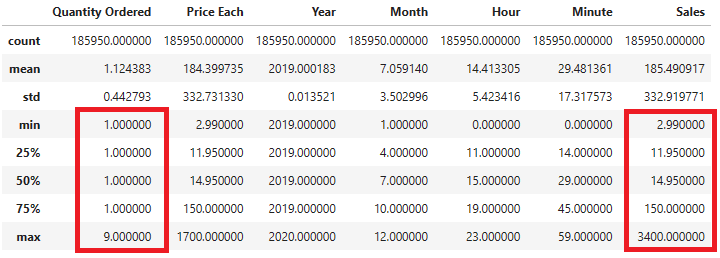
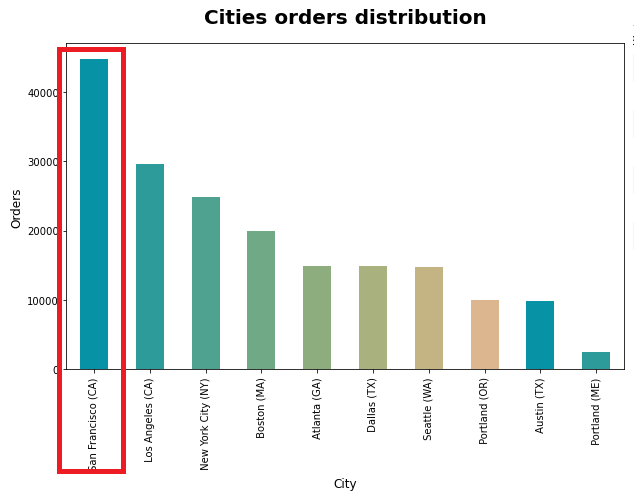
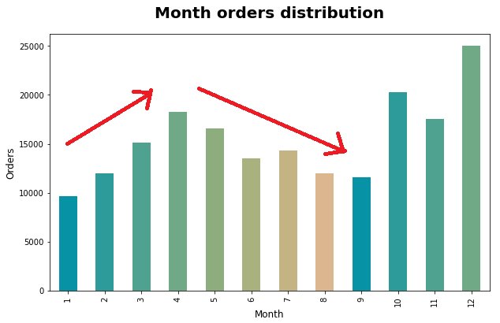
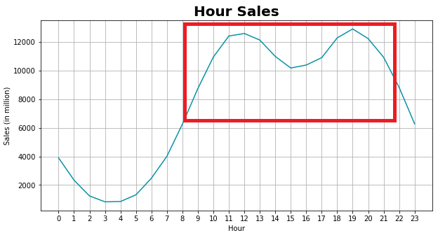
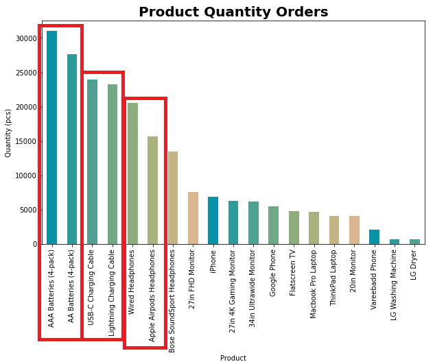
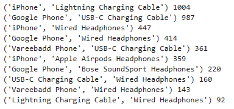
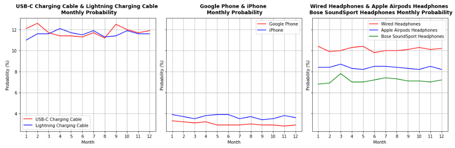

# About the project
Bluemazon is an e-commerce that focus sell electronic item. Company has run business for some year and want to improve their sales strategy. They want to analyze 2019 sales and generating insights from sales data, trends, and metrics to set targets. Company need data analyst to provides insights about the top performing and underperforming products, the problems in selling and market opportunities, and sales activities that generate revenue.


# Goals and Objective
  * Goal
    - Generate insight and recommendation based on 2019 sales data.
  * Objective
    - Process datasets to usable form
    - Analyze data and create bundle recommendation.


# Getting Started
To run this project you will need Jupyter notebook to run data analysis.
## Built with
- [![Python][Python.com]][Python-url]
- [![Jupyter][Jupyter.com]][Jupyter-url]
- <a href="https://pandas.pydata.org/">
    
  </a>

- <a href="https://matplotlib.org/stable/index.html">
    
  </a>
- <a href="https://seaborn.pydata.org/index.html">
    
  </a>
## Prerequisites
These are some library you need to run the project, i put the pip installation to make it easy for you.


* Pandas
  ```sh
  pip install pandas
  ```
* Matplotlib
  ```sh
  pip install matplotlib
  ```
* Seaborn
  ```sh
  pip install seaborn
  ```

## Resources
For more detailed dataset information visit <a href='https://www.kaggle.com/datasets/knightbearr/sales-product-data?datasetId=1695352&sortBy=voteCount'>kaggle</a> page.

# Data Processing
Avalaible data are 12 csv files for each month sales data. Dataset were concatenante and resulting 186,850 orders data. Dataset contain 545 null values and some unmatch feature data types. Extract some feature such as month, day, hour, city, sales.
# Data Analysis
## Descriptive Analysis



Customer mostly order 1 item at once, some small group order 2 item at once, highest order are in 9 item at once. Sales for each order are in range 2.99 to 3400. Distribution for sales and Price Each relatively same it is because most quantity order is 1.

Summary sales 2019, total revenue <b>34,483,365.68 USD, 185,916 orders and 209,038 items sold.</b>

## Univariate Analysis



Most of orders are from California (CA), San Francisco and Los Angeles around more than 40,000 and 30,000 orders. Average orders in cities are around 18,000 orders.



High order are happen in December and October that have 25,000 and 20,000 orders. There are increasing pattern order in January to April then decrease to September.

## Multivariate Analysis



There is peak of sales in around 9:00 to 21:00. This pattern can be a good spot to promote products to increase more sales.



Top product sold are on Battery products, then followed by Charging cable, and Headphones.

# Insight and Recommendation

1. Product Combination <br>
There are some frequently combination of products in customer orders behavior. Most of combination are in : 

    

    - Phone product + Charging cable 
    - Phone product + Headphone
    - Charging cable + Headphone

    This data can support to make product bundling to increase more sales of specifict product.

2. Rush Hour <br>
There is peak of sales in around 9:00 to 21:00. It is means that in this time range mostly customer tend to place order. This peak can be sweet spot to promote advertising.

    

    This data can be support to post more ads on the rush hour time span.

3. Order Probability <br>
Charging cable have relatively same probability. iPhone have higher probability than Google Phone. Wired Headphones have highest order probability on headphones product type.

    

    This data can support to have more product stock and marketing on higher product order probability.


[Python.com]: https://img.shields.io/badge/python-000000?style=for-the-badge&logo=python&logoColor=white
[Python-url]: https://www.python.org/
[VScode.com]: https://img.shields.io/badge/vscode-000000?style=for-the-badge&logo=visual-studio-code&logoColor=white
[VScode-url]: https://code.visualstudio.com/
[Jupyter.com]: https://img.shields.io/badge/jupyter-000000?style=for-the-badge&logo=jupyter&logoColor=white
[Jupyter-url]: https://jupyter.org/
[Selenium.com]: https://img.shields.io/badge/selenium-000000?style=for-the-badge&logo=selenium&logoColor=white
[Selenium-url]: https://www.selenium.dev/
[BS.com]: https://img.shields.io/badge/Beautifulsoup-000000?style=for-the-badge&logo=&logoColor=white
[BS-url]: https://www.crummy.com/software/BeautifulSoup/bs4/doc/
[pandas.com]: https://pandas.pydata.org/
[pandas-url]: https://img.shields.io/badge/pandas-000000?style=for-the-badge&logo=&logoColor=white
[matplotlib.com]: https://matplotlib.org/stable/index.html
[matplotlib-url]: https://img.shields.io/badge/matplotlib-000000?style=for-the-badge&logo=matplotlib&logoColor=white
[seaborn.com]: https://seaborn.pydata.org/index.html
[seaborn-url]: https://img.shields.io/badge/seaborn-000000?style=for-the-badge&logo=seaborn&logoColor=white
